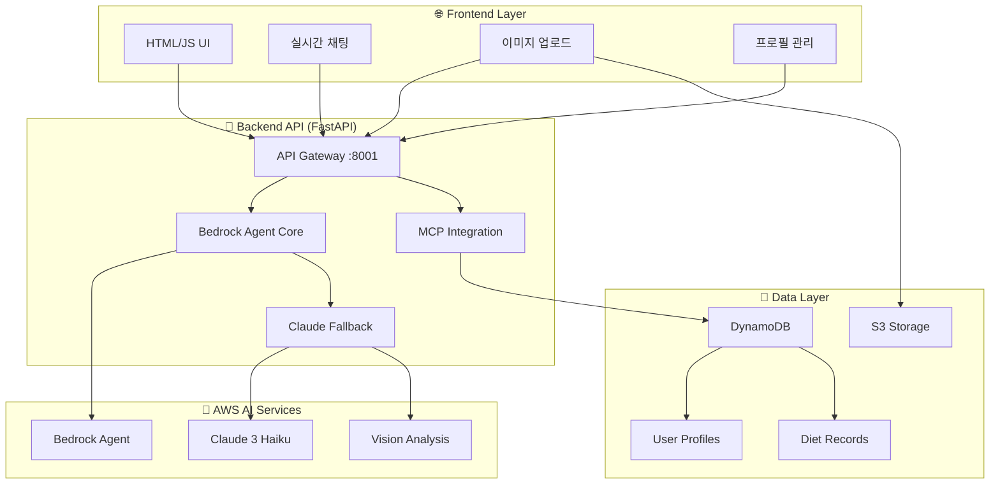

# 🤖 AI PT 쌤 (AI Personal Trainer)

> **AWS Bedrock Agent와 Claude를 활용한 차세대 개인 맞춤형 AI 다이어트 코치**

[](https://aws.amazon.com/bedrock/)
[](https://www.anthropic.com/claude)
[](https://fastapi.tiangolo.com/)
[](https://python.org)

## 📋 프로젝트 개요

AI PT 쌤은 **AWS Bedrock Agent**와 **Claude AI**를 핵심으로 하는 혁신적인 개인 맞춤형 다이어트 코치 시스템입니다. 사용자의 개인 정보, 식단 기록, 건강 목표를 종합 분석하여 실시간으로 맞춤형 조언을 제공합니다.

### 🎯 핵심 가치
- **🧠 Agentic AI**: 자율적 판단과 도구 선택으로 인간 수준의 상담 경험
- **📸 Vision AI**: 음식 사진 한 장으로 정확한 칼로리 및 영양소 분석
- **🎯 개인화**: 사용자별 BMI, 목표, 활동량 기반 맞춤 조언
- **⚡ 실시간**: 즉시 응답하는 대화형 인터페이스

## 🏗️ 시스템 아키텍처



## 🚀 핵심 기술 스택

### 🤖 AI & ML
- **AWS Bedrock Agent**: 자율적 AI 에이전트 오케스트레이션
- **Claude 3 Haiku**: 빠르고 정확한 자연어 처리
- **Vision AI**: 음식 이미지 인식 및 영양소 분석
- **MCP (Model Context Protocol)**: AI 도구 통합 및 성능 최적화

### 🔧 Backend
- **FastAPI**: 고성능 비동기 API 서버
- **Pydantic**: 타입 안전성과 데이터 검증
- **Boto3**: AWS 서비스 통합
- **Uvicorn**: ASGI 서버

### 💾 Database & Storage
- **DynamoDB**: NoSQL 사용자 데이터 저장
- **S3**: 이미지 파일 저장 및 관리
- **실시간 캐싱**: MCP 성능 최적화

### 🌐 Frontend
- **Vanilla JavaScript**: 경량화된 프론트엔드
- **Responsive Design**: 모바일 최적화
- **Real-time Chat**: 실시간 대화 인터페이스

## 🎯 주요 기능

### 🤖 Agentic AI 상담
```python
# 자율적 AI 에이전트가 상황에 맞는 도구를 선택
class BedrockAgentDietCoach:
    async def process_input(self, user_input, user_id, context):
        # 1. 사용자 의도 분석
        # 2. 적절한 도구 선택 (프로필 조회, 이미지 분석 등)
        # 3. 개인화된 응답 생성
        return personalized_response
```

### 📸 스마트 이미지 분석
- **음식 인식**: 여러 음식이 포함된 복잡한 이미지도 정확 분석
- **영양소 계산**: 칼로리, 탄수화물, 단백질, 지방 자동 계산
- **운동 추천**: 섭취 칼로리 기반 운동 시간 제안

### 👤 개인화 프로필 시스템
- **BMI 자동 계산**: 키, 몸무게 기반 체질량지수
- **목표 설정**: 체중 감량, 근육 증가, 건강 유지
- **진행 추적**: 식단 기록 및 목표 달성률 모니터링

### 💬 실시간 대화형 인터페이스
- **마크다운 지원**: 구조화된 응답 렌더링
- **이미지 미리보기**: 업로드 전 이미지 확인
- **즉시 응답**: 평균 2-3초 내 AI 응답

## 🛠️ 설치 및 실행

### 📋 필수 요구사항
- Python 3.9+
- AWS 계정 및 Bedrock 액세스
- Node.js (선택사항)

### 🔧 설치 과정

1. **저장소 클론**
```bash
git clone <repository-url>
cd ai-pt-coach
```

2. **백엔드 설정**
```bash
cd backend
pip install -r requirements.txt
```

3. **환경 변수 설정**
```bash
# .env 파일 생성
AWS_ACCESS_KEY_ID=your_access_key
AWS_SECRET_ACCESS_KEY=your_secret_key
AWS_REGION=ap-northeast-2

# Bedrock Agent 설정
BEDROCK_MODEL_ID=anthropic.claude-3-haiku-20240307-v1:0
```

4. **DynamoDB 테이블 생성**
```bash
python create_tables.py
```

5. **Bedrock Agent 생성**
```bash
python create_bedrock_agent.py
```

6. **서버 실행**
```bash
# 백그라운드 실행
nohup python run_agent.py > server.log 2>&1 &

# 또는 개발 모드
python run_agent.py
```

7. **프론트엔드 실행**
```bash
cd ../frontend-aws
# 브라우저에서 main.html 열기
python -m http.server 8000
```

## 📁 프로젝트 구조

```
ai-pt-coach/
├── 🤖 backend/
│   ├── agents/
│   │   ├── core/
│   │   │   └── bedrock_agent.py      # 메인 AI 에이전트
│   │   ├── api/
│   │   │   ├── agent_api.py          # FastAPI 엔드포인트
│   │   │   └── mcp_integration.py    # MCP 프로토콜 구현
│   │   └── tools/
│   │       ├── user_rag_tools.py     # 사용자 프로필 도구
│   │       └── diet_tools.py         # 식단 분석 도구
│   ├── src/
│   │   ├── models/
│   │   │   └── data_models.py        # Pydantic 모델
│   │   └── services/
│   │       └── dynamodb_service.py   # DynamoDB 연동
│   ├── bedrock_agent_config.json     # Agent 설정
│   ├── requirements.txt
│   └── run_agent.py                  # 서버 실행
├── 🌐 frontend-aws/
│   └── main.html                     # 웹 인터페이스
└── 📚 README.md
```

## 🔧 핵심 컴포넌트 상세

### 1. 🤖 Bedrock Agent Core
```python
class BedrockAgentDietCoach:
    """AWS Bedrock Agent 기반 자율적 AI 식단 코치"""
    
    def __init__(self):
        self.agent_id = "RYOWPEXFEG"  # 실제 Agent ID
        self.model = "claude-3-haiku"  # 빠른 응답을 위한 Haiku 모델
    
    async def process_input(self, user_input, user_id, context):
        # 이미지가 있으면 Vision 분석 우선
        if context.get("image_data"):
            return await self._analyze_food_image(...)
        
        # 텍스트 상담은 개인화된 컨텍스트와 함께
        user_context = await get_personalized_user_context(user_id)
        return await self._generate_personalized_advice(...)
```

### 2. 📸 Vision AI 분석
```python
async def _analyze_food_image(self, prompt, image_data, user_id):
    """Claude Vision을 활용한 음식 이미지 분석"""
    
    # Throttling 방지 retry 로직
    for attempt in range(3):
        try:
            response = bedrock_client.converse(
                modelId='anthropic.claude-3-haiku-20240307-v1:0',
                messages=[{
                    "role": "user",
                    "content": [
                        {"image": {"source": {"bytes": image_data}}},
                        {"text": detailed_analysis_prompt}
                    ]
                }]
            )
            break
        except ThrottlingException:
            await asyncio.sleep((attempt + 1) * 3)
```

### 3. 🔄 MCP 성능 최적화
```python
class PerformanceCache:
    """30-40% 성능 향상을 위한 캐시 시스템"""
    
    def __init__(self, ttl=300):
        self.cache = {}
        self.ttl = ttl
    
    def get(self, key):
        if key in self.cache:
            data, timestamp = self.cache[key]
            if time.time() - timestamp < self.ttl:
                return data
        return None
```

## 🎯 사용 시나리오

### 📱 일반적인 사용 흐름

1. **프로필 설정**
   ```
   사용자: ⚙️ 버튼 클릭
   → 이름, 나이, 키, 몸무게, 목표 입력
   → AI가 BMI와 목표 칼로리 자동 계산
   ```

2. **식단 상담**
   ```
   사용자: "오늘 아침 뭘 먹을까?"
   AI: 개인 프로필 기반 맞춤 메뉴 3가지 추천
   → 구체적인 칼로리와 조리법 포함
   ```

3. **이미지 분석**
   ```
   사용자: 음식 사진 + "오늘 먹은 점심이야"
   AI: 📊 식별된 음식 목록
       💡 영양 평가 및 조언
       🏃♂️ 칼로리 소모 운동 추천
   ```

## 🚀 성능 및 최적화

### ⚡ 응답 속도
- **평균 응답 시간**: 2-3초
- **이미지 분석**: 5-8초
- **MCP 캐싱**: 30-40% 성능 향상

### 🔧 Throttling 대응
- **Exponential Backoff**: 2, 4, 6초 대기
- **Model Fallback**: Sonnet → Haiku 자동 전환
- **Retry Logic**: 최대 3회 재시도

### 💾 데이터 최적화
- **DynamoDB**: NoSQL로 확장 가능한 사용자 데이터
- **S3**: 이미지 파일 효율적 저장
- **캐싱**: 반복 요청 최적화

## 🔒 보안 및 검증

### 🛡️ 데이터 보안
- **사용자 ID 해싱**: MD5 해시로 개인정보 보호
- **입력 검증**: Pydantic 모델로 타입 안전성
- **파일 검증**: 이미지 파일 형식 엄격 검사

### ✅ 에러 처리
- **Graceful Degradation**: Agent 실패 시 Claude 폴백
- **상세 로깅**: 디버깅을 위한 포괄적 로그
- **사용자 친화적 오류 메시지**

## 🔮 향후 개발 계획

### 🎯 단기 목표 (1-2개월)
- [ ] **Action Groups 통합**: Bedrock Agent 도구 연결
- [ ] **Knowledge Base 구축**: RAG 기반 영양 정보 DB
- [ ] **음성 인터페이스**: 음성 입력/출력 지원

### 🚀 중기 목표 (3-6개월)
- [ ] **모바일 앱**: React Native 기반 네이티브 앱
- [ ] **소셜 기능**: 친구와 식단 공유 및 경쟁
- [ **웨어러블 연동**: Apple Watch, Fitbit 데이터 통합

### 🌟 장기 목표 (6개월+)
- [ ] **AI 영양사 인증**: 전문 영양사 수준의 조언
- [ ] **병원 연계**: 의료진과 협업 시스템
- [ ] **글로벌 서비스**: 다국어 및 지역별 음식 DB

## 🤝 기여하기

### 💻 개발 참여
1. Fork the Project
2. Create Feature Branch (`git checkout -b feature/AmazingFeature`)
3. Commit Changes (`git commit -m 'Add AmazingFeature'`)
4. Push to Branch (`git push origin feature/AmazingFeature`)
5. Open Pull Request

### 🐛 버그 리포트
- **이슈 템플릿** 사용하여 상세한 버그 리포트
- **재현 단계** 및 **예상 결과** 명시
- **스크린샷** 또는 **로그** 첨부

## 📊 프로젝트 통계

- **총 코드 라인**: ~3,000 lines
- **API 엔드포인트**: 4개
- **지원 이미지 형식**: JPG, PNG, GIF
- **최대 이미지 크기**: 10MB
- **동시 사용자**: 100+ (확장 가능)

## 📄 라이선스

이 프로젝트는 MIT 라이선스 하에 배포됩니다. 자세한 내용은 [LICENSE](LICENSE) 파일을 참조하세요.

## 📞 지원 및 문의

- **이슈 트래커**: [GitHub Issues](https://github.com/your-repo/issues)
- **이메일**: your-email@example.com
- **문서**: [프로젝트 위키](https://github.com/your-repo/wiki)

---

<div align="center">

**🤖 Made with ❤️ using AWS Bedrock & Claude AI**

*"AI가 당신의 건강한 삶을 위한 최고의 파트너가 되어드립니다"*

[](https://aws.amazon.com/)
[](https://www.anthropic.com/)

</div>