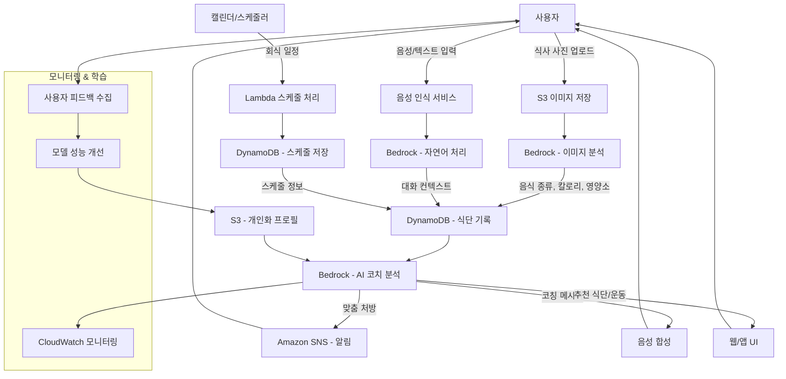

# 오피스아워 사전 과제 양식

**팀명: [ AI 식단 코치 ]**

## 1. 애플리케이션 소개 (300자 내외)

---

**AWS 기반의 개인 맞춤형 식단 관리 AI 솔루션입니다. 회식이나 일상 식사 사진을 촬영하면 음식 종류와 섭취량을 자동 분석하고, 개인의 건강 목표와 운동 선호도를 바탕으로 맞춤형 식단과 운동을 처방합니다. 음성 기반 대화형 인터페이스를 통해 AI PT가 일일/주간 식습관을 분석하고 실시간 조언을 제공하며, 스케줄러 연동으로 회식 등 예정된 식사까지 관리하여 건강한 라이프스타일을 지원합니다.**

**주요기능>**

1. **식사 이미지 분석: 사진 촬영 시 음식 종류, 칼로리, 영양소 자동 분석**
2. **AI PT 코칭: 개인 목표 기반 맞춤형 식단/운동 처방 및 실시간 조언**
3. **스케줄 연동 관리: 회식 등 예정된 식사 스케줄링 및 사전/사후 관리**

## 2. 애플리케이션의 입력

| GenAI 애플리케이션이 입력받는 데이터를 명세해주시거나 샘플 데이터로 제공해주세요. (애플리케이션의 입력이 여러개인 경우, 핵심 기능을 위주로 설명해주세요.) |
|---|

**[애플리케이션 입력]**

1. **식사 이미지 데이터: 회식, 일상 식사 사진 (JPG/PNG 형식)**
   - 예시: 삼겹살 회식 사진, 집밥 사진, 외식 사진 등

2. **개인화 정보 (초기 설정)**
   - 선호/비선호 운동 목록 (헬스, 요가, 러닝, 수영 등)
   - 건강 목표 (체중 관리, 근육 증가, 바디프로필, 건강 유지)
   - 기본 정보 (나이, 성별, 신장, 체중, 활동량)

3. **음성/텍스트 대화 입력**
   - "어제 회식에서 많이 먹었어", "오늘 운동할 시간이 없어" 등
   - 일상 대화를 통한 컨텍스트 정보

4. **스케줄 정보**
   - 캘린더 연동을 통한 회식, 약속 일정

## 3. 애플리케이션의 동작 과정

---

GenAI 애플리케이션의 동작 과정을 알려주세요. 아키텍처 이미지, 스케치, 플로우 다이어그램 등 편하신 방법을 선택하여 제공해주시고 아래에 과정을 설명해주세요.

---

**[동작 과정]**

1. **식사 이미지 분석 프로세스**
   - 사용자가 식사 사진을 촬영하여 S3에 업로드
   - Bedrock 이미지 분석 모델을 통해 음식 종류, 예상 칼로리, 영양소 구성 분석
   - 함께 식사한 인원 수 파악하여 1인분 섭취량 계산
   - DynamoDB에 식단 기록 저장

2. **AI 코치 대화 시스템**
   - 음성/텍스트 입력을 통한 자연어 처리 (Bedrock)
   - 개인화 프로필과 식단 기록을 종합 분석
   - 실시간 코칭 메시지 생성 및 음성 합성으로 전달

3. **스케줄 연동 관리**
   - 캘린더 API를 통해 회식 등 예정된 식사 일정 수집
   - Lambda를 통한 스케줄 전처리 및 사전 알림 설정
   - 예정된 식사 후 추가 질문을 통한 실제 섭취량 확인

4. **개인화 추천 시스템**
   - 일일/주간 식습관 패턴 분석
   - 목표 대비 진행상황 평가
   - 맞춤형 식단/운동 처방 생성
   - Amazon SNS를 통한 알림 및 격려 메시지 전송

## 4. 기대하는 애플리케이션의 출력

---

GenAI 애플리케이션에서 기대하는 출력을 작성해주세요.

---

**[출력 예시]**

1. **실시간 AI 코칭 메시지**
   - "오늘 탄수화물 섭취가 목표보다 30% 많네요. 저녁에는 단백질 위주로 드시는 게 좋겠어요!"
   - "어제 회식에서 무리하셨군요. 오늘은 가벼운 유산소 30분과 충분한 수분 섭취를 권해드려요."
   - "이번 주 식단 관리 잘하고 계시네요! 목표 체중까지 2kg 남았어요."

2. **개인 맞춤 식단/운동 처방**
   - **오늘의 추천 메뉴**: 탄수화물 120g, 단백질 80g, 지방 45g (총 1,200kcal)
     - 아침: 오트밀 + 베리류 + 아몬드
     - 점심: 닭가슴살 샐러드 + 현미밥 1/2공기
     - 저녁: 연어구이 + 브로콜리 + 고구마
   - **추천 운동**: 헬스 (상체 위주) 60분 + 유산소 20분

3. **주간/월간 분석 리포트**
   - 칼로리 섭취 추이 그래프
   - 영양소 균형 분석 (탄단지 비율)
   - 목표 달성률 및 개선점
   - 다음 주 목표 설정 가이드

4. **스마트 알림 시스템**
   - 식사 시간 알림: "점심시간인데 아직 식사 안 하셨나요?"
   - 회식 사전 준비: "내일 저녁 회식 예정이시네요. 점심은 가볍게 드세요!"
   - 운동 독려: "오늘 목표 운동량의 60% 달성! 조금만 더 힘내세요!"

5. **대화형 질의응답**
   - "지난 주 다이어트 어떻게 진행됐어?" → 상세 분석 결과 제공
   - "오늘 치킨 먹어도 될까?" → 오늘 섭취량 기반 조언
   - "살 빼려면 어떤 운동이 좋을까?" → 개인 선호도 기반 추천